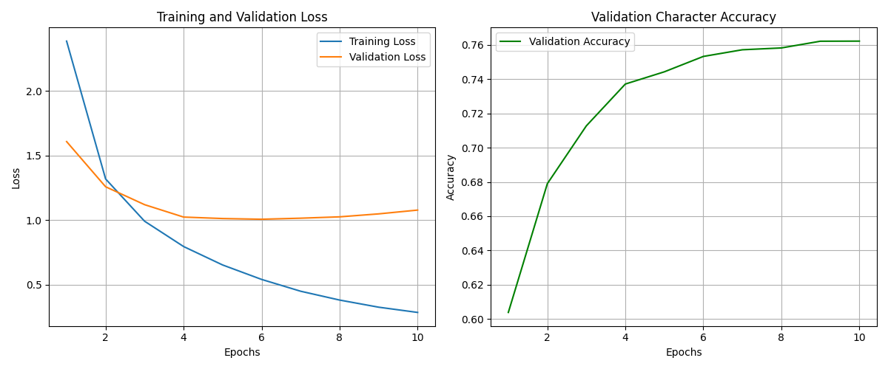
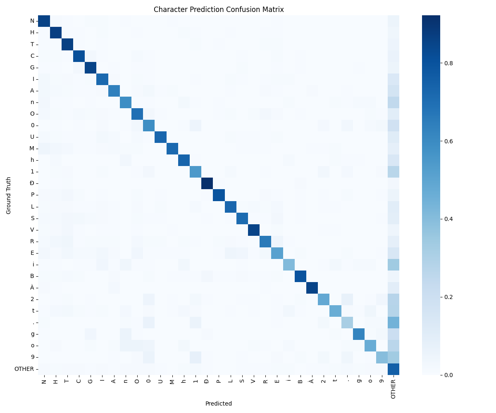
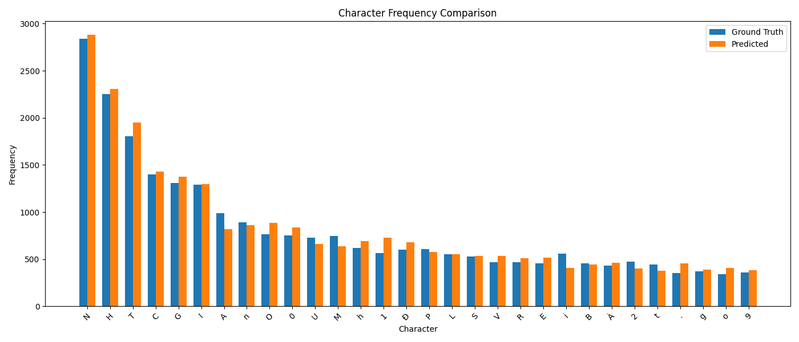
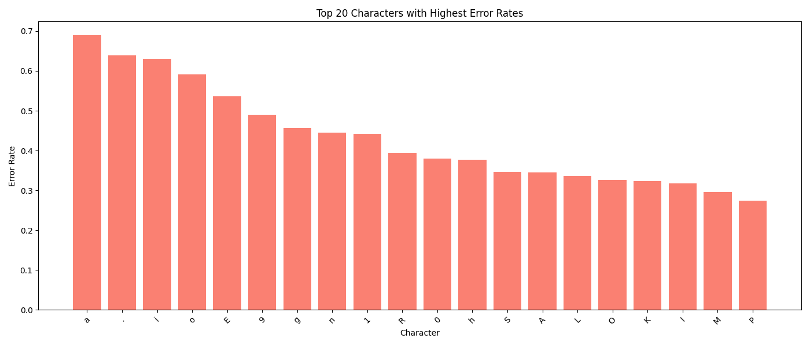
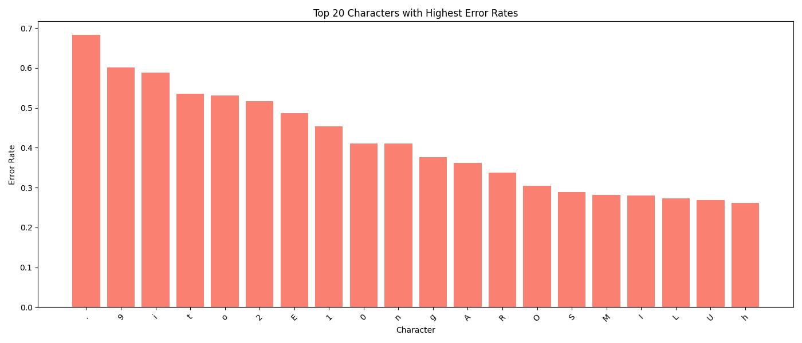

# Vietnamese Scene Text Recognition with CNN-Transformer

  

Mô hình nhận dạng văn bản tiếng Việt từ ảnh (Scene Text Recognition) sử dụng kiến trúc kết hợp CNN-Transformer.

## Tổng quan

Hệ thống kết hợp sức mạnh của:

-   ResNet18 để trích xuất đặc trưng từ ảnh
-   Transformer Decoder để sinh chuỗi văn bản đầu ra
-   Cơ chế attention để tập trung vào các vùng quan trọng của ảnh

### Dataset

Dự án sử dụng bộ dữ liệu từ VinAI Research's Dictionary-guided Scene Text Recognition:

-   Dữ liệu text từ ảnh thực tế trong môi trường tự nhiên
-   Đa dạng về font chữ, góc độ và điều kiện ánh sáng
-   Chứa nhiều văn bản tiếng Việt có dấu
-   Hơn 17,000 mẫu được gán nhãn thủ công
-   Chia thành tập train, test và unseen test

Nguồn dữ liệu:

-   [VinAI Research - Dictionary-guided Scene Text Recognition](https://github.com/VinAIResearch/dict-guided)
-   [Vietnamese OCR Dataset on Kaggle](https://www.kaggle.com/datasets/trongnguyen04/vietnamese-ocr)

### Cấu trúc Project

Xem chi tiết tại: [directory_structure.txt](directory_structure.txt)

## Kết Quả và Phân Tích

### 1. Tổng Quan Hiệu Suất

  

#### 1.1 Tập Test

| Metric                     | Giá trị       |
| -------------------------- | ------------- |
| Character Error Rate (CER) | 35.94%        |
| Word Accuracy              | 49.46%        |
| Character Accuracy         | 65.59%        |
| Edit Distance (trung bình) | 1.38 ký tự/từ |
| Số mẫu                     | 7,220         |

#### 1.2 Tập Unseen Test

| Metric                     | Giá trị       |
| -------------------------- | ------------- |
| Character Error Rate (CER) | 30.84%        |
| Word Accuracy              | 53.46%        |
| Character Accuracy         | 70.03%        |
| Edit Distance (trung bình) | 1.22 ký tự/từ |
| Số mẫu                     | 10,086        |

### 2. Phân Tích Chi Tiết

#### 2.1 Ma Trận Nhầm Lẫn

  <table>
    <tr>
      <td></td>
      <td></td>
    </tr>
    <tr>
      <td align="center">Tập Test</td>
      <td align="center">Tập Unseen Test</td>
    </tr>
  </table>

#### 2.2 Phân Bố Tần Suất Ký Tự

  <table>
    <tr>
      <td></td>
      <td></td>
    </tr>
    <tr>
      <td align="center">Tập Test</td>
      <td align="center">Tập Unseen Test</td>
    </tr>
  </table>

#### 2.3 Tỷ Lệ Lỗi Ký Tự

  <table>
    <tr>
      <td></td>
      <td></td>
    </tr>
    <tr>
      <td align="center">Tập Test</td>
      <td align="center">Tập Unseen Test</td>
    </tr>
  </table>

### 3. Phân Tích Kết Quả

#### 3.1 Điểm Nổi Bật

1. **Hiệu suất trên dữ liệu unseen**:

    - Mô hình thực hiện tốt hơn trên tập unseen test
    - CER giảm từ 35.94% xuống 30.84%
    - Độ chính xác ký tự tăng từ 65.59% lên 70.03%

2. **Độ chính xác từ vs ký tự**:

    - Độ chính xác ký tự (~65-70%) cao hơn đáng kể so với độ chính xác từ (~49-53%)
    - Trung bình 1.2-1.4 lỗi/từ

3. **Phân bố lỗi**:
    - Tập trung vào dấu thanh và dấu phụ tiếng Việt
    - Nhầm lẫn giữa các ký tự tương tự (u-ư, o-ơ)
    - Khó khăn với văn bản dài và chất lượng ảnh kém

#### 3.2 Đề Xuất Cải Thiện

1. **Cải Thiện Nhận Dạng Dấu**

    - Tăng cường dữ liệu về dấu thanh và dấu phụ
    - Data augmentation cho ký tự dễ nhầm lẫn
    - Thu thập thêm dữ liệu cho cases khó

2. **Tối Ưu Kiến Trúc**

    - Thử nghiệm backbone CNN mạnh hơn (ResNet50, EfficientNet)
    - Điều chỉnh Transformer cho văn bản dài
    - Thêm cơ chế attention đặc biệt cho dấu

3. **Cải Thiện Training**
    - Fine-tune hyperparameters
    - Thêm regularization
    - Thử nghiệm loss functions khác

### Tham khảo

-   [VinAI Research - Dictionary-guided Scene Text Recognition](https://github.com/VinAIResearch/dict-guided)
-   [Vietnamese OCR Dataset on Kaggle](https://www.kaggle.com/datasets/trongnguyen04/vietnamese-ocr)
-   [Scene Text Recognition using ResNet and Transformer](https://medium.com/geekculture/scene-text-recognition-using-resnet-and-transformer-c1f2dd0e69ae)
-   [Scale ML OCR Documentation](https://scale-ml.github.io/docs/OCR/)
-   [Transformer OCR Implementation](https://github.com/fengxinjie/Transformer-OCR)
-   [Attention Is All You Need](https://arxiv.org/abs/1706.03762)
-   [Deep Residual Learning](https://arxiv.org/abs/1512.03385)
