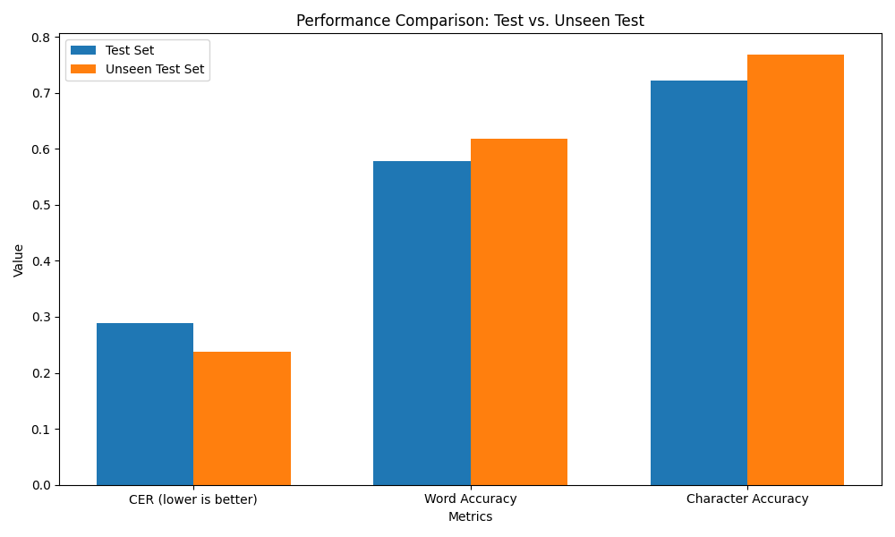
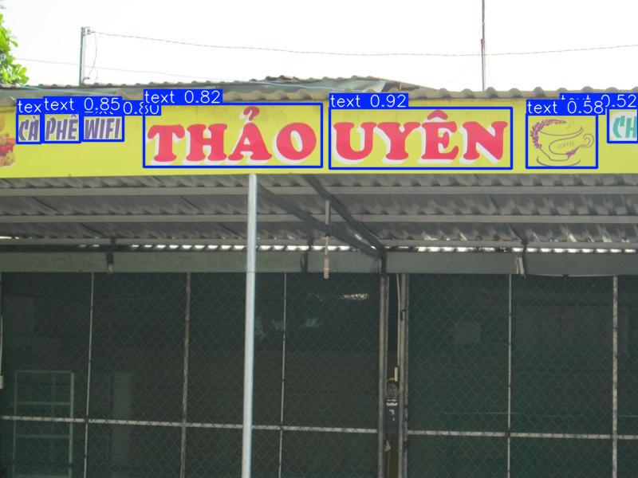
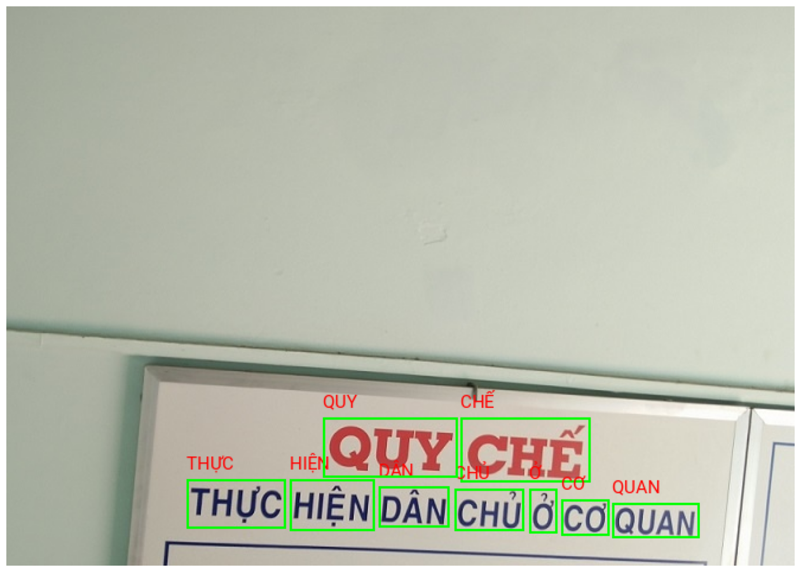
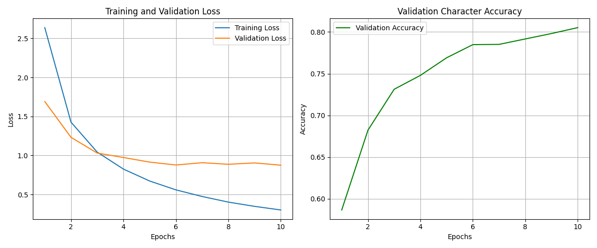
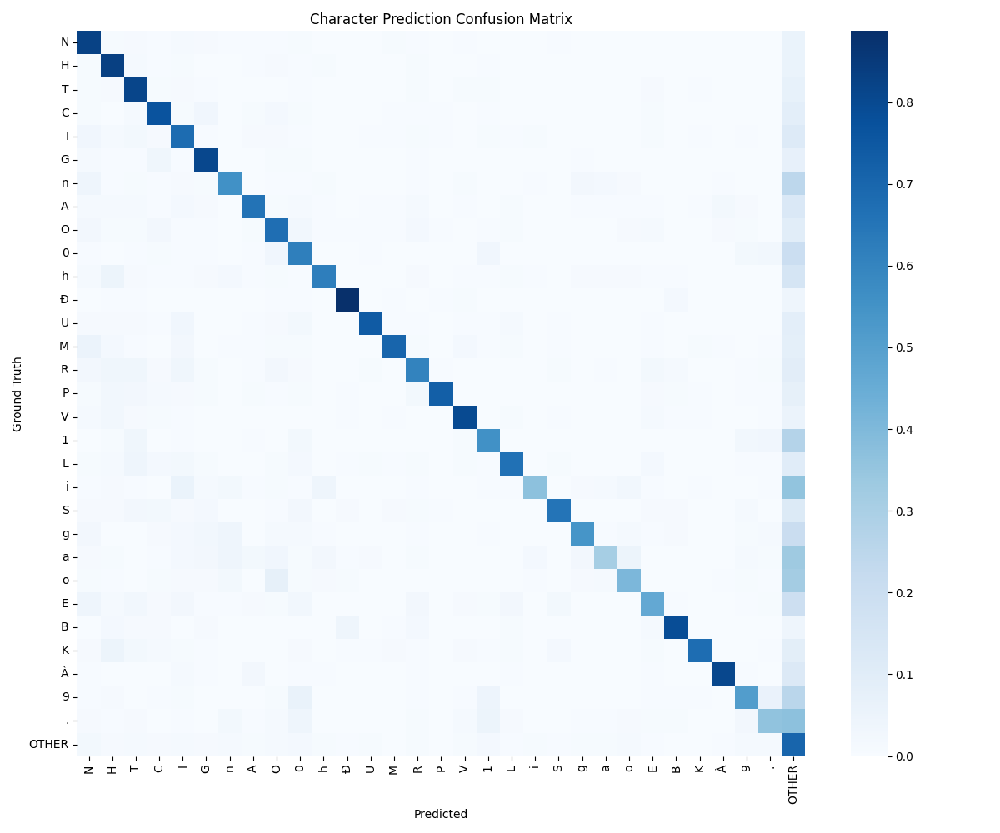
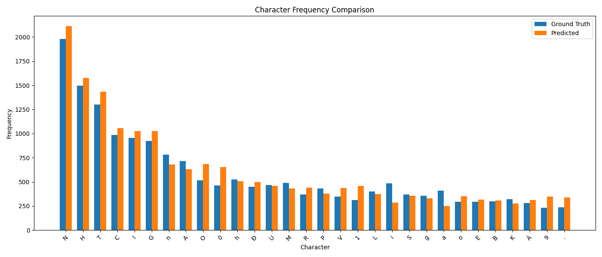

# Vietnamese Scene Text Recognition System

  

Hệ thống nhận dạng văn bản tiếng Việt từ ảnh (Scene Text Recognition) với khả năng:

-   Phát hiện vùng chứa text trong ảnh (YOLO)
-   Nhận dạng nội dung văn bản tiếng Việt có dấu (OCR)
-   Xử lý được nhiều điều kiện ánh sáng và góc độ khác nhau
-   Hoạt động real-time trên giao diện web

## Tải Model

Tải model checkpoint đã train tại: [Vietnamese ResNet-Transformer OCR Model](https://www.kaggle.com/code/trongnguyen04/vietnamese-resnet-transformer-ocr/output)

## Cách Thức Hoạt Động

### 1. Quy Trình Xử Lý

1. **Phát hiện vùng text (YOLO)**

    - Sử dụng YOLO để xác định các vùng có khả năng chứa text
    - Xử lý được text nhiều góc độ và kích thước
    - Lọc kết quả với ngưỡng tin cậy > 0.5

2. **Nhận dạng văn bản (OCR)**

    - Cắt và chuẩn hóa các vùng text đã phát hiện
    - Nhận dạng nội dung text trong từng vùng
    - Tự động xử lý dấu thanh và dấu phụ tiếng Việt

3. **Hậu xử lý**
    - Kiểm tra và điều chỉnh dấu thanh
    - Lọc kết quả có độ tin cậy thấp
    - Sắp xếp text theo thứ tự đọc tự nhiên

### 2. Demo

  <table>
    <tr>
      <td></td>
      <td></td>
    </tr>
    <tr>
      <td align="center">Phát hiện vùng text</td>
      <td align="center">Kết hợp OCR</td>
    </tr>
  </table>

## Kết Quả Thử Nghiệm

### 1. Hiệu Suất Training

  

Biểu đồ thể hiện quá trình cải thiện độ chính xác trong quá trình training.

### 2. Phân Tích Chi Tiết

#### 2.1 Kết Quả Nhận Dạng

| Metric                     | Tập Test      | Tập Unseen    |
| -------------------------- | ------------- | ------------- |
| Character Error Rate (CER) | 28.94%        | 23.81%        |
| Word Accuracy              | 57.74%        | 61.77%        |
| Character Accuracy         | 72.14%        | 76.75%        |
| Edit Distance (trung bình) | 1.07 ký tự/từ | 0.89 ký tự/từ |
| Số mẫu                     | 7,220         | 10,086        |

  
  
<em>Ma trận nhầm lẫn ký tự</em>

  
  
<em>Phân bố tần suất ký tự</em>

### 3. Phân Tích Hiệu Suất

#### 3.1 Điểm Mạnh

-   Xử lý tốt text ngắn (<10 ký tự): >80% accuracy
-   Ổn định với các font phổ biến
-   Chịu được góc nghiêng nhẹ (<15°)
-   Nhận dạng được hầu hết dấu thanh tiếng Việt

#### 3.2 Điểm Yếu

-   Giảm độ chính xác với text dài
-   Nhạy cảm với nhiễu và mờ
-   Khó khăn với góc nghiêng lớn
-   Dễ nhầm lẫn các ký tự tương tự (u-ư, o-ơ)

### Tham khảo

-   [VinAI Research - Dictionary-guided Scene Text Recognition](https://github.com/VinAIResearch/dict-guided)
-   [Vietnamese OCR Dataset on Kaggle](https://www.kaggle.com/datasets/trongnguyen04/vietnamese-ocr)
-   [Scene Text Recognition using ResNet and Transformer](https://medium.com/geekculture/scene-text-recognition-using-resnet-and-transformer-c1f2dd0e69ae)
-   [Scale ML OCR Documentation](https://scale-ml.github.io/docs/OCR/)
-   [Transformer OCR Implementation](https://github.com/fengxinjie/Transformer-OCR)
-   [Attention Is All You Need](https://arxiv.org/abs/1706.03762)
-   [Deep Residual Learning](https://arxiv.org/abs/1512.03385)
